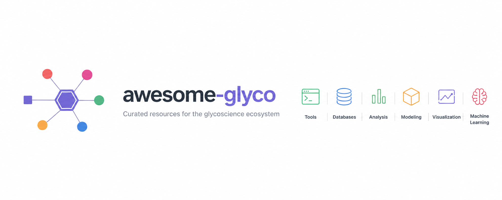

# awesome-glyco 

Lista curada por la comunidad de paquetes de software y recursos de datos para la GlicoCiencia [Contribuciones bienvenidas](https://github.com/amanzadi/awesome-glyco/blob/main/CONTRIBUTING.md).

Esta colección está inspirada en [awesome-single-cell](https://github.com/seandavi/awesome-single-cell).

La etiqueta **Recommended** lista mis favoritos: solo reflejan mi referencia personal y no han sido evaluados rigurosamente. ¡Contáctame si deseas que se agregue otro software!

## Contenido

- [awesome-glyco](#awesome-glyco)
  - [Contenido](#contents)
  - [Paquetes de software](#software-packages)
  - [Portales web y bases de datos](#web-portals-and-databases)
  - [Visualización y análisis interactivos](#interactive-visualization-and-analysis)
  - [Herramientas de aprendizaje automático](#machine-learning-tools)

## Paquetes de software

### Análisis y procesamiento general de glicanos
- [Glycowork](https://github.com/BojarLab/glycowork) - [python] - Glycowork es un paquete de Python diseñado específicamente para simplificar el procesamiento y análisis de secuencias de glicanos. Versión actual 1.7.0 con ~50.500 secuencias de glicanos únicas. **Recommended**
- [Glycoverse](https://github.com/glycoverse) - [R] - Glycoverse es un ecosistema modular completo de R para el análisis de datos de glicómica y glicoproteómica. Incluye glyrepr, glyparse (CRAN), glyread, glyclean, glystats, glymotif, glydet y glyenzy. **Recommended**

### Predicción de estructura de glicanos a partir de espectrometría de masas
- [CandyCrunch](https://github.com/BojarLab/CandyCrunch) - [python] - Paquete de aprendizaje profundo para predecir la estructura de glicanos a partir de datos de LC-MS/MS. Entrenado con 500.000 espectros anotados con una precisión top-1 del 90,3 %. Incluye una tubería de inferencia y herramientas de procesamiento de espectros. **Recommended**
- [GlycoGenius](https://github.com/glycogenius/glycogenius) - [python/GUI] - Herramienta automatizada de identificación de composición de glicanos de alto rendimiento con construcción de espacio de búsqueda, puntuación, cuantificación y anotación de fragmentos para glicanos N/O y glicosaminoglicanos.
- [pGlyco3](https://www.nature.com/articles/s41592-024-02464-7) - [software] - Motor de búsqueda de glicopéptidos N/O intactos con prioridad en glicanos, 5-40 veces más rápido que la competencia. Acompañado de pGlycoQuant para cuantificación basada en redes residuales profundas.
- [FragPipe / MSFragger-Glyco](https://fragpipe.nesvizhskii.org/) - [software] - Flujo de trabajo de glicoproteómica activamente mantenido con análisis y cuantificación integrales de glicopéptidos.
- [GRable](https://github.com/glycosmos/grable) - [software] - Análisis de glicoformas sitio-específico basado en MS1 con detección mejorada de glicopéptidos. Disponible en línea a través del Portal GlyCosmos.

### Modelado de glicoproteínas y estructura 3D
- [GlycoShape](https://glycoshape.org/) - [webportal/database] - Base de datos de acceso abierto de datos estructurales 3D de glicanos con más de 534 estructuras derivadas de dinámica molecular (MD). Se puede descargar o utilizar con Re-Glyco para reconstruir glicoproteínas a partir de los repositorios RCSB PDB o AlphaFold. **Recommended**
- [Re-Glyco](https://github.com/Ojas-Singh/Re-Glyco) - [python] - Reglicosila estructuras de proteínas utilizando resultados de simulaciones MD de la base de datos glycoshape. Toma estructuras de proteínas de AlphaFold como entrada y devuelve estructuras modificadas con glicanos en los sitios apropiados. [demo en línea](https://glycoshape.org/reglyco)
- [GLYCAM-Web](https://www.glycam.org/) - [webserver] - Genera estructuras 3D experimentalmente consistentes de oligosacáridos para la interpretación de datos, visualización, acoplamiento molecular y simulación.
- [GlycoSHIELD](https://github.com/GlycoSHIELD-MD/GlycoSHIELD-MD) - [python] - Tubería de MD simple para generar modelos realistas de glicoproteínas con bibliotecas de conformeros de glicanos precalculados.
- [Glycosylator](https://github.com/ibmm-unibe-ch/glycosylator) - [python] - Marco de Python versátil para el modelado rápido de glicanos y glicoproteínas.
- [GlyCONFORMER](https://github.com/IsabellGrothaus/GlyCONFORMER) - [python] - Código para generar cadenas de conformeros de N-glicanos basadas en valores de ángulos de torsión.

### Análisis de rasgos en glicómica
- [GlyTrait](https://github.com/fudan-gly) - [python] - Calcula 354 rasgos derivados de N-glicanos con estadísticas integradas y aprendizaje automático interpretable (XGBoost + SHAP). Informe de AUC-ROC promedio de 0,915.
- [GlycoTraitR](https://github.com/glycoverse) - [R] - Caracteriza la macro y microheterogeneidad en datos de glicoproteómica N-enlazada. Compatible con las salidas de pGlyco3 y Glyco-Decipher.

## Portales web y bases de datos

### Recursos principales de glicoCiencia
- [GlyCosmos](https://glycosmos.org/) - [webportal] - Portal web semántico unificado (v4) que integra las glicoCiencias con las ciencias de la vida. Incluye GlyTouCan, GlycoPOST, UniCarb-DR, glicogenes, glicoproteínas, lectinas, vías y enfermedades. **Recommended**
- [GlyGen](https://www.glygen.org/) - [webportal] - Proyecto de integración y difusión de datos relacionados con carbohidratos y glicoconjugados. La versión de mayo de 2025 agregó páginas de estado de tareas, sistema de carrito, soporte multiespecie, datos de tejidos de GlycomeAtlas y APIs. **Recommended**
- [GlyTouCan](https://www.glytoucan.org/) - [database] - Repositorio internacional de estructuras de glicanos con más de 244.842 entradas. Emite accesiones basadas en WURCS con un sistema de validación.
- [GlycoShape](https://glycoshape.org/) - [webportal/database] - Base de datos de acceso abierto de datos e información estructural 3D de glicanos. Integrada con Re-Glyco para la reconstrucción de glicoproteínas.

### Bases de datos especializadas
- [Glyco3D](https://glyco3d.cermav.cnrs.fr/) - [webportal] - Portal de bases de datos que cubre características tridimensionales de monosacáridos, oligosacáridos (conformaciones y espectros de RMN), polisacáridos, glicosiltransferasas, lectinas y proteínas que se unen a glicosaminoglicanos.
- [Human Glycome Atlas (TOHSA)](https://tohsa.jp/) - [database] - Proyecto japonés del MEXT que analiza muestras de sangre para construir una base de conocimiento integral de glicómica humana.
- [GlycoCoO](https://github.com/glycoinfo/GlycoCoO/wiki) - [database] - Ontología de glicoconjugados que proporciona una ontología estándar para datos de glicoconjugados, incluyendo estructuras, información de publicación, fuente biológica y datos experimentales.
- [GlycoRDF](https://github.com/glycoinfo/GlycoRDF/wiki) - [database] - Representación estándar RDF para almacenar datos de glicómica, incluyendo estructuras, información de publicación, fuente biológica y datos experimentales.
- [CarboGrove](https://www.carbogrove.org/) - [database] - Especificidades de unión de arrays de glicanos agregadas desde 36 plataformas de arrays.
- [GlycoMaple](https://www.glycomaple.org/) - [webportal] - Visualización interactiva de vías de glicosilación que abarca 21 vías y más de 1000 genes.
- [CSDB](http://csdb.glyco.ac.ru/) - [database] - Base de datos de Estructuras de Carbohidratos con visualización 2D/3D, soporte para SMILES y más de 600 estructuras de residuos.

## Visualización y análisis interactivos

- [GlyConnect Compozitor](https://glyconnect.expasy.org/compozitor/) - [webserver] - Visualiza composiciones de glicanos como una red de relaciones que muestra monosacáridos compartidos. Genera gráficos interactivos a partir de consultas a la base de datos GlyConnect.
- [GlycoDraw](https://github.com/BojarLab/glycowork) - [python] - Generación automatizada de figuras de glicanos en notación SNFG integrada en glycowork. Produce gráficos vectoriales listos para publicación.
- [GlycoGlyph](https://glycoglyph.expasy.org/) - [webapp] - Aplicación web para dibujar y nombrar glicanos en notación SNFG con conversión bidireccional de nombre a estructura.
- [DrawGlycan-SNFG / gpAnnotate](https://www.drawglycan.com/) - [webserver] - Renderizado de IUPAC a SNFG con anotación de fragmentos de glicopéptidos.
- [GlycoMaple](https://www.glycomaple.org/) - [webportal] - Visualización interactiva de vías de glicosilación mapeada a datos de expresión génica.
- [3D-SNFG in Mol* / LiteMol](https://molstar.org/) - [viewer] - Muestra símbolos de glicanos en estructuras de proteínas 3D en el navegador web.
- [PepSweetener](https://www.pepsweetener.org/) - [webserver] - Visualiza combinaciones de precursores de glicopéptidos en mapas de calor interactivos.

## Herramientas de aprendizaje automático

- [CandyCrunch](https://github.com/BojarLab/CandyCrunch) - [python] - Aprendizaje profundo para la predicción de estructuras de glicanos en MS/MS con una precisión top-1 del 90,3 % en 500.000 espectros anotados. **Recommended**
- [GlycanML](https://github.com/glyeanml/glyeanml) - [benchmark/dataset] - Benchmark multitarea y multiestructura con 11 tareas de ML para glicanos, incluida taxonomía, inmunogenicidad, tipo de glicosilación e interacción proteína-glicano. Tabla de clasificación y conjuntos de datos mantenidos.
- [GIFFLAR](https://arxiv.org/abs/2409.13467) - [python] - Transmisión de mensajes de orden superior en complejos combinatorios para el aprendizaje de representación de glicanos.
- [GlycanAA / PreGlycanAA](https://arxiv.org/abs/2506.01376) - [python] - Codificadores jerárquicos de glicanos de todos los átomos que ocupan el primer y segundo lugar en el benchmark GlycanML.
- [GlycanGT](https://github.com/glycangt/glycangt) - [python] - Modelo base graph-transformer preentrenado con preentrenamiento de modelo de lenguaje enmascarado y completado de secuencias generativas.
- [GlycoTrans](https://github.com/cabsel/glycotrans) - [python] - Modelos Transformer (GlycoBERT y GlycoBART) para predecir estructuras de glicanos a partir de espectros MS/MS.
- [LectinOracle](https://github.com/BojarLab/glycowork) - [python] - Aprendizaje profundo para predecir la unión proteína-glicano (lectina). Integrado en glycowork.
