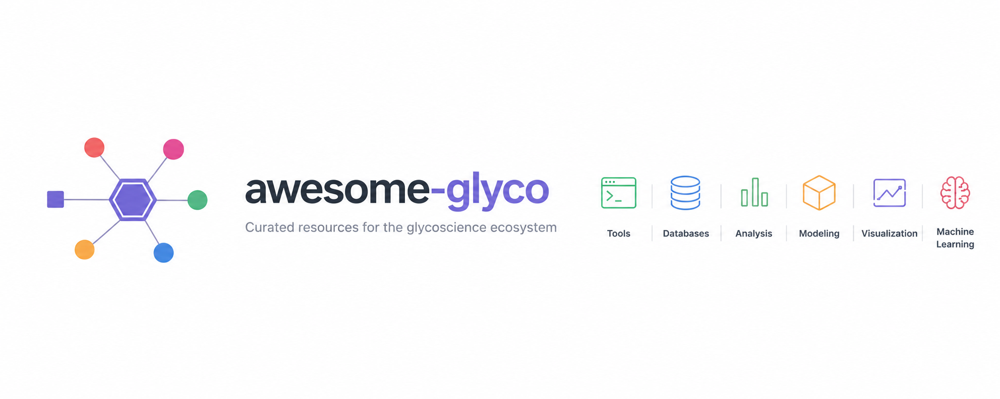

# awesome-glyco 

Community-curated list of software packages and data resources for Glycoscience [Contributions welcome](https://github.com/amanzadi/awesome-glyco/blob/main/CONTRIBUTING.md).

This collection is inspired by [awesome-single-cell](https://github.com/seandavi/awesome-single-cell).

**Recommended** label lists my favorites -- they only reflect my personal reference and are not rigorously evaluated. Contact me if you would like other software to be added!

## Contents

- [awesome-glyco](#awesome-glyco)
  - [Contents](#contents)
  - [Software packages](#software-packages)
  - [Web portals and databases](#web-portals-and-databases)
  - [Interactive visualization and analysis](#interactive-visualization-and-analysis)
  - [Machine learning tools](#machine-learning-tools)

## Software packages

### General glycan analysis & processing
- [Glycowork](https://github.com/BojarLab/glycowork) - [python] - Glycowork is a Python package specifically designed to simplify glycan sequence processing and analysis. Current version 1.7.0 with ~50,500 unique glycan sequences. **Recommended**
- [Glycoverse](https://github.com/glycoverse) - [R] - Glycoverse is a comprehensive modular R ecosystem for glycomics and glycoproteomics data analysis. Includes glyrepr, glyparse (CRAN), glyread, glyclean, glystats, glymotif, glydet, and glyenzy. **Recommended**

### Glycan structure prediction from mass spectrometry
- [CandyCrunch](https://github.com/BojarLab/CandyCrunch) - [python] - Deep learning package for predicting glycan structure from LC-MS/MS data. Trained on 500,000 annotated spectra with 90.3% top-1 accuracy. Includes inference pipeline and spectrum processing tools. **Recommended**
- [GlycoGenius](https://github.com/glycogenius/glycogenius) - [python/GUI] - Automated high-throughput glycan composition identification tool with search space building, scoring, quantification, and fragment annotation for N/O-glycans and glycosaminoglycans.
- [pGlyco3](https://www.nature.com/articles/s41592-024-02464-7) - [software] - Glycan-first intact N/O-glycopeptide search engine, 5-40x faster than competitors. Paired with pGlycoQuant for deep residual network-based quantitation.
- [FragPipe / MSFragger-Glyco](https://fragpipe.nesvizhskii.org/) - [software] - Actively maintained glycoproteomics workflow with comprehensive glycopeptide analysis and quantification.
- [GRable](https://github.com/glycosmos/grable) - [software] - MS1-based site-specific glycoform analysis with improved glycopeptide detection. Available online via GlyCosmos Portal.

### Glycoprotein modeling & 3D structure
- [GlycoShape](https://glycoshape.org/) - [webportal/database] - Open-access database of glycans 3D structural data with 534+ MD-derived structures. Can be downloaded or used with Re-Glyco to rebuild glycoproteins from RCSB PDB or AlphaFold repositories. **Recommended**
- [Re-Glyco](https://github.com/Ojas-Singh/Re-Glyco) - [python] - Re-glycosylates protein structures using MD simulation results from the glycoshape database. Takes AlphaFold protein structures as input and outputs modified structures with glycans at appropriate sites. [online demo](https://glycoshape.org/reglyco)
- [GLYCAM-Web](https://www.glycam.org/) - [webserver] - Generate experimentally consistent 3D structures of oligosaccharides for data interpretation, visualization, molecular docking and simulation.
- [GlycoSHIELD](https://github.com/GlycoSHIELD-MD/GlycoSHIELD-MD) - [python] - Simple MD pipeline to generate realistic glycoprotein models with precomputed glycan conformer libraries.
- [Glycosylator](https://github.com/ibmm-unibe-ch/glycosylator) - [python] - Versatile Python framework for rapid modeling of glycans and glycoproteins.
- [GlyCONFORMER](https://github.com/IsabellGrothaus/GlyCONFORMER) - [python] - Code to generate N-glycan conformer strings based on torsion angle values.

### Glycomics trait analysis
- [GlyTrait](https://github.com/fudan-gly) - [python] - Calculates 354 N-glycan-derived traits with integrated statistics and interpretable ML (XGBoost + SHAP). Reported average ROC AUC 0.915.
- [GlycoTraitR](https://github.com/glycoverse) - [R] - Characterizes macro- and micro-heterogeneity in N-linked glycoproteomics data. Compatible with pGlyco3 and Glyco-Decipher outputs.

## Web portals and databases

### Primary glycoscience resources
- [GlyCosmos](https://glycosmos.org/) - [webportal] - Unified semantic web portal (v4) integrating glycosciences with life sciences. Includes GlyTouCan, GlycoPOST, UniCarb-DR, glycogenes, glycoproteins, lectins, pathways, and diseases. **Recommended**
- [GlyGen](https://www.glygen.org/) - [webportal] - Data integration and dissemination project for carbohydrate and glycoconjugate-related data. May 2025 release added job-status pages, cart system, multi-species support, GlycomeAtlas tissue data, and APIs. **Recommended**
- [GlyTouCan](https://www.glytoucan.org/) - [database] - International glycan structure repository with 244,842+ entries. Issues WURCS-based accessions with validation system.
- [GlycoShape](https://glycoshape.org/) - [webportal/database] - Open-access database of glycans 3D structural data and information. Integrated with Re-Glyco for glycoprotein rebuilding.

### Specialized databases
- [Glyco3D](https://glyco3d.cermav.cnrs.fr/) - [webportal] - Portal of databases covering three-dimensional features of monosaccharides, oligosaccharides (conformations and NMR spectra), polysaccharides, glycosyltransferases, lectins, and glycosaminoglycan binding proteins.
- [Human Glycome Atlas (TOHSA)](https://tohsa.jp/) - [database] - Japanese MEXT project analyzing blood samples to build comprehensive human glycomics knowledgebase.
- [GlycoCoO](https://github.com/glycoinfo/GlycoCoO/wiki) - [database] - Glycoconjugate Ontology providing standard ontology for glycoconjugate data including structures, publication information, biological source, and experimental data.
- [GlycoRDF](https://github.com/glycoinfo/GlycoRDF/wiki) - [database] - Standard RDF representation for storing glycomics data including structures, publication information, biological source, and experimental data.
- [CarboGrove](https://www.carbogrove.org/) - [database] - Glycan-array binding specificities aggregated from 36 array platforms.
- [GlycoMaple](https://www.glycomaple.org/) - [webportal] - Interactive glycosylation pathway visualization covering 21 pathways and 1000+ genes.
- [CSDB](http://csdb.glyco.ac.ru/) - [database] - Carbohydrate Structure Database with 2D/3D visualization, SMILES support, and 600+ residue structures.

## Interactive visualization and analysis

- [GlyConnect Compozitor](https://glyconnect.expasy.org/compozitor/) - [webserver] - Visualizes glycan compositions as network of relations showing shared monosaccharides. Outputs interactive graphs from GlyConnect database queries.
- [GlycoDraw](https://github.com/BojarLab/glycowork) - [python] - Automated SNFG glycan figure generation integrated in glycowork. Produces publication-ready vector graphics.
- [GlycoGlyph](https://glycoglyph.expasy.org/) - [webapp] - Web app for drawing and naming glycans in SNFG notation with bidirectional name-to-structure conversion.
- [DrawGlycan-SNFG / gpAnnotate](https://www.drawglycan.com/) - [webserver] - IUPAC-to-SNFG rendering with glycopeptide fragment annotation.
- [GlycoMaple](https://www.glycomaple.org/) - [webportal] - Interactive glycosylation pathway visualization mapped to gene expression data.
- [3D-SNFG in Mol* / LiteMol](https://molstar.org/) - [viewer] - Display glycan symbols on 3D protein structures in web browser.
- [PepSweetener](https://www.pepsweetener.org/) - [webserver] - Visualizes glycopeptide precursor combinations on interactive heat-maps.

## Machine learning tools

- [CandyCrunch](https://github.com/BojarLab/CandyCrunch) - [python] - Deep learning for MS/MS glycan structure prediction with 90.3% top-1 accuracy on 500,000 annotated spectra. **Recommended**
- [GlycanML](https://github.com/glyeanml/glyeanml) - [benchmark/dataset] - Multi-task, multi-structure benchmark with 11 glycan ML tasks including taxonomy, immunogenicity, glycosylation type, and protein-glycan interaction. Maintained leaderboard and datasets.
- [GIFFLAR](https://arxiv.org/abs/2409.13467) - [python] - Higher-order message passing on combinatorial complexes for glycan representation learning.
- [GlycanAA / PreGlycanAA](https://arxiv.org/abs/2506.01376) - [python] - Hierarchical all-atom glycan encoders ranking first and second on GlycanML benchmark.
- [GlycanGT](https://github.com/glycangt/glycangt) - [python] - Pretrained graph-transformer foundation model with masked-language-model pretraining and generative sequence completion.
- [GlycoTrans](https://github.com/cabsel/glycotrans) - [python] - Transformer models (GlycoBERT & GlycoBART) for predicting glycan structures from MS/MS spectra.
- [LectinOracle](https://github.com/BojarLab/glycowork) - [python] - Deep learning for predicting protein-glycan (lectin) binding. Integrated in glycowork.
